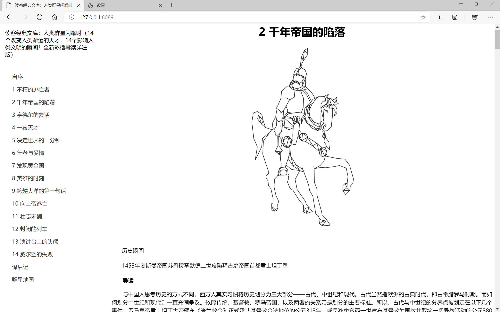

# ebook-web

[](https://travis-ci.com/seasona/ebook-web)
[](https://img.shields.io/github/license/seasona/ebook-web)

ebook-web is a CLI tool to read epub, mobi, azw3 and txt format ebook easily in your browser

## Table of Contents

* [About the Project](#about-the-project)
  * [Feature](#feature)
  * [Platform](#platform)
  * [Built With](#built-with)
* [Getting Started](#getting-started)
  * [Prerequisites](#prerequisites)
  * [Installation](#installation)
* [Usage](#usage)
* [License](#license)


## About The Project



### Feature

- [x] parse and read epub format ebook
- [x] parse and read mobi, azw3 format ebook
- [x] parse and read txt format ebook
- [x] support create charpter directory of all format ebook
- [ ] maintain your local ebook shelf

### Platform

linux

### Built With

g++ 7.5.0 and higher

cmake 3.11 and higher

## Getting Started

### Prerequisites

ebook-web is depend on zlib, minizip and libxml2, you can choose to build them through sourse code from the ebook-web or use the system lib installed locally

```shell
sudo apt-get install -y zlib1g-dev libxml2-dev libminizip-dev
```

### Installation

```shell
cd ebook-web/
mkdir -p build && cd build
cmake ../ -DUSE_SYSTEM_LIBS=ON  
make 
```

The unit test option is `JEBOOK_SERVER_TEST`, if you want to run test, use:

```shell
- cmake ../ -DUSE_SYSTEM_LIBS=ON -DJEBOOK_SERVER_TEST=ON 
- make -j$(nproc) 
- make test
```

## Usage

```shell
Ebook reading CLI tool
Usage:
  ./Jebook_server [OPTION...]

  -i, --ip arg         IP address (default: localhost)
  -p, --port arg       Port (default: 8089)
  -d, --directory arg  Ebook output directory (default: ./)
  -t, --template arg   Web template location (default:
                       ../../web/template.html)
  -b, --book arg       Ebook location
      --help           Print help
```

Generally, you can use ebook-web simply by:

```
./Jebook_server -b my_book
```

then open your browser and enter `http://localhost:8089/`. You can enjoy reading your ebook now! 

## License

Distributed under the MIT License. See `LICENSE` for more information.


